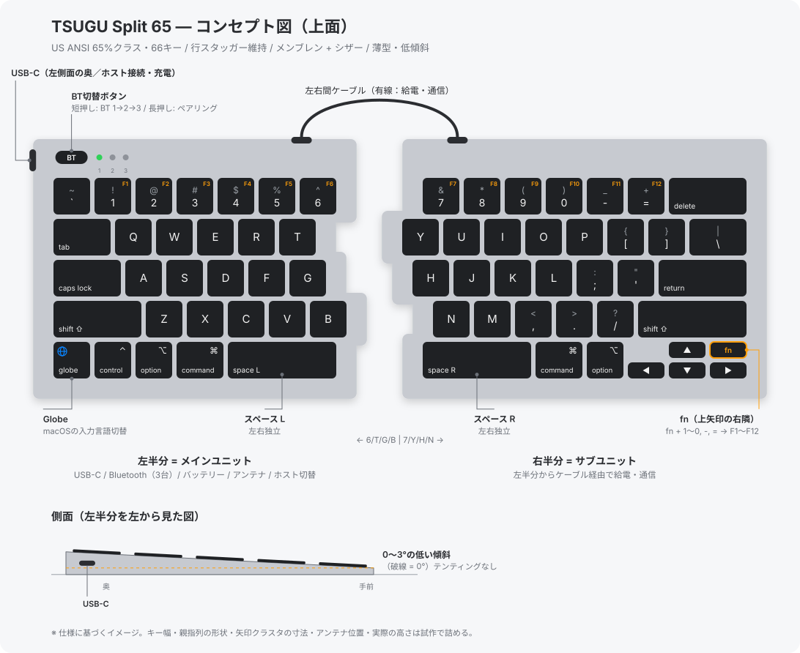

# TSUGU Split 65

MacBook Airとの行き来で迷わない配列と打鍵感を目指す、薄型の左右分割
キーボード。製品名の「TSUGU」は、Macの入力体験を継ぎ、左右のユニットと
複数のホストをつなぐことに由来する。

## Status

要件とプロジェクト構成を確定済み。コードCAD（build123d）のツール基盤とCI、
設計パラメータとキーレイアウト（`cad/source/tsugu65/`）を整備済みで、形状は
まだない。電子回路、ファームウェア、製造物は未作成。

## 確定仕様

- 配列: US ANSI、ファンクション列なしの65%クラス（66キー）
- 分割: `6/T/G/B` を左、`7/Y/H/N` を右に置く。通常の行スタッガーを維持し、
  中央のギャップのみで左右を分ける
- 親指列: 左右に独立したスペースキーを置く。左下のGlobeキーはmacOSの入力言語
  切替に使う
- Fn: 上矢印の右隣に置く。`fn` + `1`〜`0`、`-`、`=` をF1〜F12に割り当てる
- キー機構: メンブレン + シザー（パンタグラフ）。薄型、静音、明確な底打ちを
  通じてMacBook Airに近い打鍵感を目指す
- 接続: USB-C有線、Bluetooth 3台の複数ペアリング、有線の左右間接続
- 操作: 左半分に置く専用ボタンでBluetooth接続先を切り替える。短押しでBT 1〜3、
  長押しで現在のスロットをペアリング待機にする
- 電源と通信: 左半分をメインユニットとし、USB-C、Bluetooth、バッテリー、
  アンテナ、ホスト切替を担当する。右半分には左右間ケーブルで給電・通信する。
  USB-Cポートは左半分の外側（左）側面の奥寄りに置く
- 筐体: 軽量な非金属を基本とし、標準姿勢は0〜3度の低い傾斜にする
- CAD: build123dでモデリングし、FreeCADで図面・解析を行う。単位はミリメートル
- 試作筐体: DMM.makeのPA12を候補とする

## 物理レイアウト



```text
左半分                           右半分
`  1  2  3  4  5  6        7  8  9  0  -  =  delete
tab  Q  W  E  R  T          Y  U  I  O  P  [  ]  \
caps A  S  D  F  G          H  J  K  L  ;  '  return
shift Z  X  C  V  B         N  M  ,  .  /  shift
globe ctrl option command space-L | space-R command option left down up fn right
```

キーの幅、親指列の詳細な形状、Bluetoothアンテナの位置、実際の高さは設計時に
試作で詰める。テンティングは初号機の要件に含めない。

## 試作方針

初号機では、互換性を確認したドナーキーボードからシザー機構、シリコンドーム、
キーキャップを流用してよい。メンブレンシート、シザー固定プレート、筐体、電子
回路は新規に設計する。量産判断の前に、部品の安定供給、権利、耐久性、修理性を
別途検証する。

## ディレクトリ構成

- `cad/source/`: code-CAD source of truth (`tsugu65/`) and tests (`tests/`)
- `cad/export/`: generated STEP, STL, SVG, and inspection report (not committed)
- `drawings/`: FreeCAD TechDraw sources and dimensioned drawings
- `pcb/`: PCB design files
- `firmware/`: keyboard firmware
- `bom/`: bill of materials
- `manufacturing/`: supplier-specific deliverables and production notes

## CAD成果物のライフサイクル

`cad/source/` のPythonスクリプトとパラメータを設計の正本とする
（[ADR-0003](../../../docs/adr/0003-code-cad-source-of-truth.md)）。
`cad/export/` の生成物はコミットせず、CIのartifactとして取得する。

```sh
uv sync                 # 依存をインストール
uv run tsugu65-build    # cad/export/ に生成物を出力
uv run pytest           # テスト
```

FreeCADの図面は、生成したSTEPを取り込んでレビューや発注の節目で更新する。
発注時は使用した生成物を `manufacturing/<service>/<rev>/` にコピーしてコミットする。
発注前には、選択した材料と製造サービスの最新ガイドラインに照らして出力を検証する。
